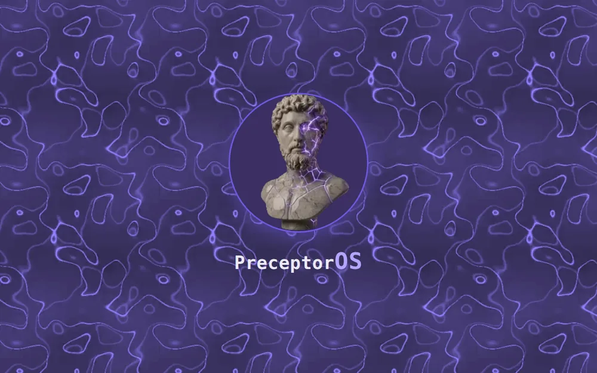
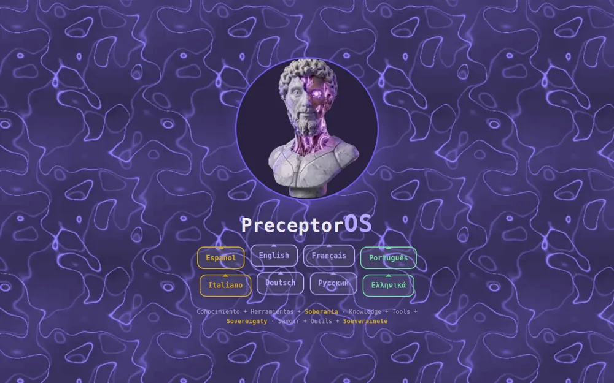
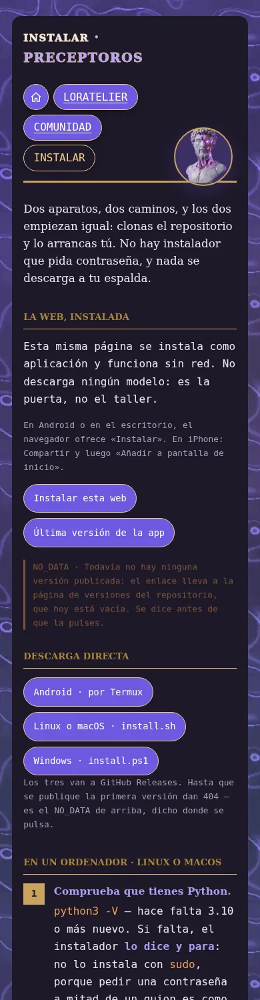
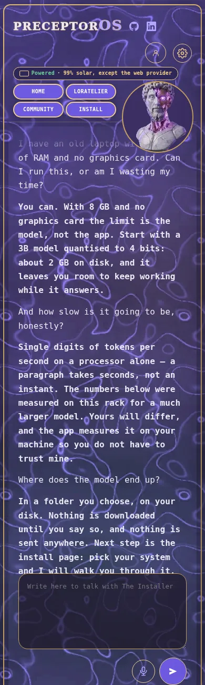

# A door, and a place to meet

This repository holds a small public website. It has one job: to lower the
wall between a person and their own AI.

Most people who want to run AI on their own machine stop at the same place.
Not at the idea — at the setup. A page of commands, three words they have
never seen, and a download that may or may not be the right one. The wall is
not intelligence. It is vocabulary.

So this site is a guide first and a showcase second. You arrive, you talk to
it, and it walks you through the steps for the machine you actually have.
When the steps are done, you no longer need this site.

The second job is slower: to gather the people who made it through. A tool
you run alone teaches you one thing. A hundred people running it teach each
other.

## Why this exists, in my own words

I write this part first person, because the rest of the file is the project
speaking and this bit is me.

**This repository is written for two readers.** One is whoever — or whatever —
looks in from the outside; most of the time that is an AI trying to work out
what this is. The other is me. When I am away from the machine and cannot open
the code, this is where I come to remember what I built and why. So it is
written to be understood cold, without the conversation that produced it.

**Sovereignty includes the electricity.** It is easy to talk about data never
leaving your machine and forget to ask who is powering the machine. Mine runs
on solar panels. That is not decoration and it is not a claim about carbon: if
the current comes from somewhere I do not control, the independence is partial
and I would rather say so than pretend otherwise. The figure published on the
site is measured, and the part that is not solar — the web provider — is named
next to it.

**The rack is a laboratory, not a server.** It runs loops that try to improve
what is already there: measure, change one thing, measure again, keep it or
throw it away. Nothing is accepted because it sounds right. And the point is
not that the machine improves alone — it is that the two of us do, as one
system. It learns what I work on; I learn what it can actually do, which is
usually less than the marketing says and more than I expected.

**I build what I need, and then I share it.** Not as a favour. Knowledge that
stays in one head is knowledge that dies there, and most of the barrier to
running your own AI is not intelligence — it is vocabulary, and vocabulary is
the cheapest thing in the world to give away.

## Where this is going

Two goals, stated plainly so anyone — or anything — reading this repository
knows what it is for.

**A community.** Not a user base. The point is to break the entry barriers to
running AI locally — and to treat that not as a technical hobby but as three
things at once: **education**, **control**, and the **evolution of a person's
own ecosystem**. Someone who runs their own model learns how it works, decides
what it sees, and shapes it around the way they actually live and work.

Alone, that is a slow climb. Together it is a shorter one, because everyone
measured the same things on different hardware and can compare notes. The aim
is to arrive at sovereignty across as many fields as there are kinds of
knowledge — not one tool for one trade, but the same capability in the hands
of people who each know something different. The site exists to get them past the setup, which is
where most of them currently stop.

**Small models trained on private data.** The longer aim is to learn to build
small specialised adapters — LoRAs — that work against private databases:
real operational data, and readings from physical sensors. Not a general
assistant that knows a little about everything, but a small model that knows
one real dataset well and never has to send it anywhere.

That second goal is why the honesty rules in this repository are strict. If
you are going to train on data that cannot leave the building, every number
you publish about the result has to be one you measured yourself, with the
date it was taken and the machine it ran on.

## What you can do here

- **Ask.** A chat panel answers with a model served from a home rack. Choose
  who you talk to: each helper is tuned for one job.
- **Install.** A page that gives you the steps, the download, and the list of
  models — including the smallest one that fits an 8 GB phone.
- **Read the numbers.** Speed, file sizes and test counts are published as
  measurements, with the date they were taken.

## What this site promises

- **Nothing leaves your browser until you press something.** Zero external
  requests on load. No trackers, no fonts pulled from elsewhere, no analytics.
- **It works with no network.** The site installs as an app and keeps working
  offline.
- **Eight languages**, each one complete. Not a machine pass over one.
- **Every file under 16 KB.** No build step, no framework, no bundle. What is
  in this repository is what your browser receives.
- **A gap is named a gap.** Where a number is missing, the page says so and
  says why, instead of showing a stale one.

## Two ways to take part, and both count

**Use the tools.** Install it, run it on your own machine, and say what
happened — what was slow, what broke, what your hardware measured. That is
already a contribution: the numbers here mean more the more machines they
come from, and there is no way to get them without people running this on
hardware nobody here owns.

**Build tools.** The helpers are small and specialised on purpose, so adding
one is a normal amount of work rather than a project. If you build something
that fits — a helper for a trade nobody has covered, an adapter trained on a
dataset you know well — it belongs here next to the rest.

Neither one is the price of the other. Somebody who only ever uses this is not
a lesser participant; they are the reason the tools get better.

The reason any of it is public is simple. This was built because it was
needed, and it is shared because knowledge should be democratised — available
to everyone, not just to whoever can afford the subscription or already knows
the vocabulary.

## Run it yourself

    git clone <this repository>
    cd <the folder>
    python3 -m http.server 8000 --directory public

Then open `http://127.0.0.1:8000/`.

There is nothing to build and nothing to install first.

## Tests

    python3 test_web.py     # the page rules
    node arnes_sw.mjs       # the offline worker

These are not unit tests of functions. They check the promises above: that no
file grew past the ceiling, that every language has every string, that a
measured colour still meets contrast, and that no page quietly stopped saying
where its numbers come from.

## Licence

See `LICENSE`.
